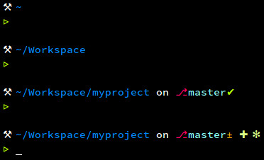

# Workbench ⚒ Personnal theme for Oh My ZSH

A personal Oh My ZSH theme.

## Preview



## Installation

1. Download `workbench.zsh-theme` into `~/.oh-my-zsh/themes`

	```shell
	$ cd ~/.oh-my-zsh/themes
	$ curl -O https://raw.githubusercontent.com/u8slvn/workbench-oh-my-zsh-theme/master/workbench.zsh-theme
	```

2. Open `.zshrc` file and set `ZSH_THEME` to `workbench`

3. Reload ZSH

	```shell
	$ source ~/.zshrc
	```

4. Watch for [customization options](#customization)

## Prompt status

* **⚙** : background job(s) working
* **✘** : previous command failed

## Git legend

#### Informations

* **±** : dirty working directory
* **✔** : clean working directory

#### Status
* **✚** : added file(s)
* **✖** : deleted file(s)
* **✸** : modified file(s)
* **✻** : untracked file(s)
* **➜** : renamed file(s)
* **⤔** : unmerged file(s)

## Customization

Workbench theme provides some customization options.

#### Use

Add this to your `.zshrc` file :
```
# Workbench theme customization
OMZSH_WORKBENCH_PROMPT_INLINE="false"
OMZSH_WORKBENCH_PROMPT_STATUS="true"
OMZSH_WORKBENCH_SHORT_PWD="false"
```

#### Details

* `OMZSH_WORKBENCH_PROMPT_INLINE`: display the prompt line on one line
* `OMZSH_WORKBENCH_PROMPT_STATUS`: hide the prompt status part
* `OMZSH_WORKBENCH_SHORT_PWD`: display only the working directory in the path 

#### Customization example

1. `OMZSH_WORKBENCH_SHORT_PWD="true"`
	
	

2. `OMZSH_WORKBENCH_PROMPT_INLINE="true"`
	
	
